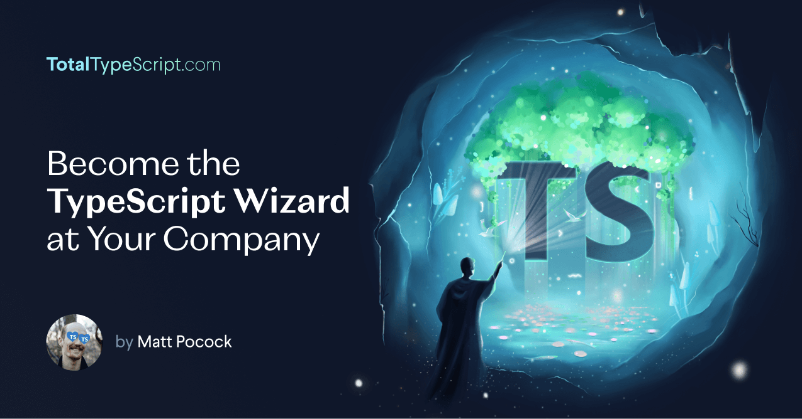

## Quickstart

Clone this repo or [open in Gitpod](https://gitpod.io/#https://github.com/total-typescript/beginners-typescript).

| Instruction   |  yarn |   npm |
|---------------|-------|-------|
| Installs all dependencies  | `yarn install` |  `npm install` |
| Starts the first exercise  | `yarn exercise 01`  | `npm run exercise 01` |
| Runs linting and tests on the solution  | `yarn solution 01` | `npm run solution 01` |

## Video Walkthrough

I walked through the first few exercises on [VSCode's live stream](https://www.youtube.com/watch?v=p6dO9u0M7MQ)! The plan for these exercises is to develop them into a full workshop, and then bundle them into the full video course - [Total TypeScript](https://totaltypescript.com).

## How to take the course

You'll notice that the course is split into exercises. Each exercise is split into a `*.problem.ts` and a `*.solution.ts`.

To take an exercise:

- Go into `*.problem.ts`
- Run the exercise:
    - `yarn exercise 01`
    - or:
    - `npm run exercise 01`

Where `01` is the number of the exercise you're on. 

The `exercise` script will run TypeScript typechecks and a test suite on the exercise.

This course encourages **active, exploratory learning**. In the video, I'll explain a problem, and **you'll be asked to try to find a solution**. To attempt a solution, you'll need to:

1. Check out [TypeScript's docs](https://www.typescriptlang.org/docs/handbook/intro.html)
2. Try to find something that looks relevant.
3. Give it a go to see if it solves the problem.

You'll know if you've succeeded because the tests will pass.

**If you succeed**, or **if you get stuck**, unpause the video and check out the `*.solution.ts`. You can see if your solution is better or worse than mine!

You can run `yarn solution 01` or `npm run solution 01` to run the tests and typechecking on the solution.

## Acknowledgements

Say thanks to Matt on [Twitter](https://twitter.com/mattpocockuk) or by joining his [Discord](https://discord.gg/8S5ujhfTB3). Consider signing up to his [Total TypeScript course](https://totaltypescript.com).

## Reference

| Command   |  alias |
|---------------|-------|
| Run the corresponding `*.problem.ts` file: |
| `yarn exercise 01`  | `yarn e 01` 
| `npm run exercise 01`  | `npm run e 01` 
| Run the corresponding `*.solution.ts` file. If there are multiple, it runs only the first one. | 
| `yarn solution 01` | `yarn s 01` |
| `npm run solution 01` | `run run s 01` |

